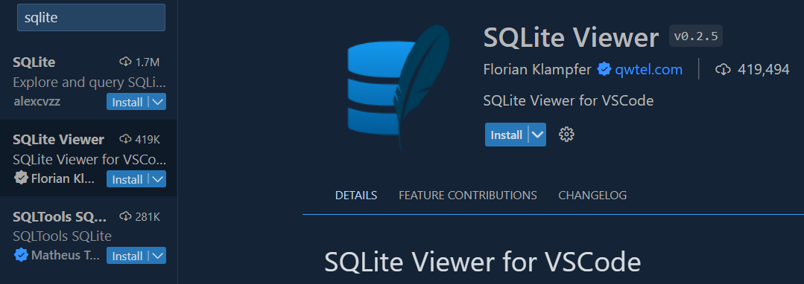

# **Introducción a FastAPI**
Hola a todos, en este pequeño tutorial veremos como instalar FastAPI y una pequeña introducción a este maravilloso framework.

FastAPI se destaca por su alta velocidad y rendimiento, es un framework completo para construir APIs en Python, que proporciona herramientas para facilitar el desarrollo y aumentar el rendimiento de las aplicaciones web.
___
## **Requisitos**
Para poder llevar el curso sin problemas usaremos VSCode y las extensiones *Thunder Client* y *SQLite Viewer*, luego crearemos y activaremos un entorno virtual.

___
## **Configuración del proyecto**
### 1. Crea una carpeta donde irá todo el proyecto y ábrela, una vez dentro dale click derecho y abre git bash

### 2. Clonamos el repositorio con el comando y después abrimos VSCode
- *git clone https://github.com/HugoGT/FastAPI .* | **Nótese el punto al final del comando**
- *code .*

### 3. Instalamos las extensiones

- Thunder Client

- SQLite Viewer

### 4. Creamos un entorno virtual
- *py -m venv venv* | **Otras opciones pueden ser python o python3**

### 5. Activamos el entorno virtual y revisamos que este activo | **Debe devolver solo (venv) en ambos comandos**
- *source venv/Scripts/activate* | o
- *source venv\Scripts\activate* | o
- *source venv/bin/activate* | **Linux y Mac**
* pip freeze

### 6. Instalamos las dependencias
- *pip install -r requirements.txt*

### 7. Prendemos el servidor | **El último output será: "Aplication startup complete."**
- *uvicorn main:app --reload*

### 8. Abrimos el VSCode y nos dirigimos a la extensión Thunder Client (al final a la izquierda de VSCode)

- Presionamos "New Request"

- Se te abrirá una nueva pestaña, en esta enviamos una petición GET a http://127.0.0.1:8000 y como resultado deberías recibir un "Hola Mundo!"

_* Si no aparece revisar la instalación y reiniciar VSCode_

## **Felicidades! Prendiste tu primer servidor en FastAPI, cumplidos estos requisitos estamos listos para comenzar**
---

***Créditos a Yuri Díaz***
